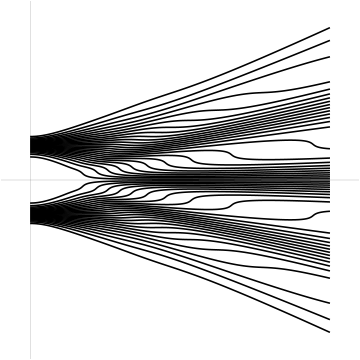
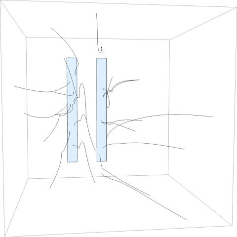
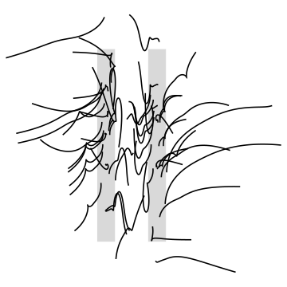
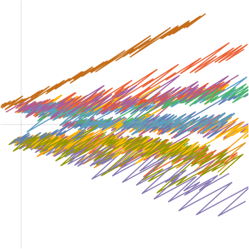

# Diffraction and interference with run-and-tumble particles

For more information, check out our paper at [arxiv:2106.XXXXX [physics.comp-ph]](https://arxiv.org/abs/2106.XXXXX)

## Example images








## Requirements

* Julia
* [StaticArrays](https://juliaarrays.github.io/StaticArrays.jl/stable/)
* Mathematica for visualization

## Citation

If you find this research useful, please consider citing
```
@misc{zigzag2021,
      title={Diffraction and interference with run-and-tumble particles}, 
      author={Christian Maes and Kasper Meerts and Ward Struyve},
      year={2021},
      eprint={2106.XXXXX},
      archivePrefix={arXiv},
      primaryClass={physics.comp-ph}
}
```
